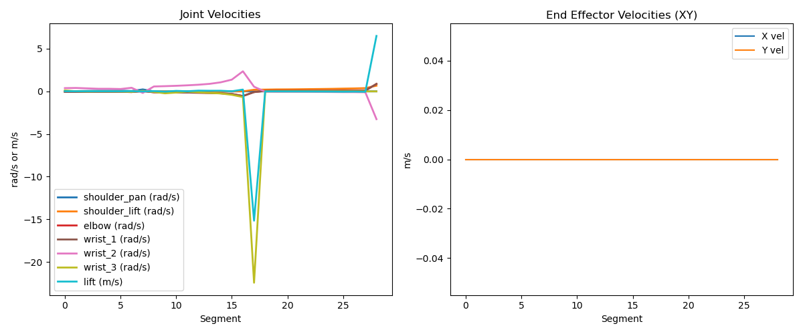
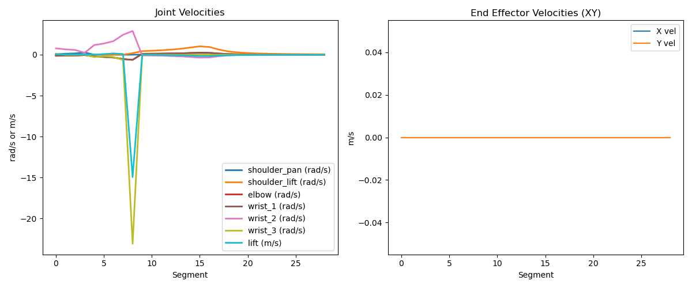

# Summary
This document provides a summary of the cartesian-lift project, which involves simulating and controlling Cartesian motions of a 6-DOF robotic arm mounted on a vertical prismatic joint (lift) using ROS 2 and Ignition Gazebo. The project includes various phases, task management strategies, and environment setup instructions.
It outlines the deliverables for each phase, the progress log, and the structure of the project. The project is designed to be modular, allowing for easy updates and modifications as needed.


## Project Overview
The cartesian-lift project aims to simulate and control a 6-DOF robotic arm with a vertical lift joint using ROS 2 and Ignition Gazebo. The project is structured into several phases, each with specific deliverables and tasks. The project also includes a task management system to track progress and deliverables.

__note:__ More detail on the project is written in the README.md


## Project Phases

## Phase 0: Environment Setup

### Deliverables:

* [ ] Dockerfile for ROS 2 + Ignition Gazebo
* [ ] Verified URDF model with 6-DOF

This phase took up some time due to the need to understand xacros for the UR10E model. The Dockerfile was set up with necessary dependencies, and the URDF model was prepared.


## Phase 1: Robot Model & Simulation
### Deliverables:

* [ ] URDF model with 6-DOF and vertical lift joint
* [ ] Ignition Gazebo simulation setup

In this phase, the focus was on creating a detailed URDF model of the robotic arm, including the vertical lift joint. The Ignition Gazebo simulation environment was also set up to allow for testing and validation of the robot model. Although there were some issues with the gazebo_ros2_control plugin, the transmission was fixed, and the robot model was successfully spawned in the simulation environment. I did not want to modify the existing URDF model too much, so I used xacros to create a new URDF model with the vertical lift joint. However, the process took longer than expected due to the complexity of the xacros and the need to understand how they work with the UR10E model. At the end of this phase, the robot model was successfully spawned in Ignition Gazebo, and basic Cartesian motion at a fixed Z using a trapezoidal profile was implemented.


## Phase 2: Lift Control
### Deliverables:
* [ ] ROS 2 node for vertical lift control
* [ ] Integration with Gazebo for lift motion   

In this phase, the focus was on implementing the vertical lift control for the robotic arm. A ROS 2 node was created to handle the lift motion, and it was integrated with the Gazebo simulation environment. The lift control was tested, and basic functionality was verified. The lift control node was designed to allow for smooth vertical motion of the robotic arm, enabling it to reach different heights as required.

The idea was to create a node that uses the trac_IK library for inverse kinematics (IK) calculations, but it was found that trac_ik does not support ROS 2 natively. There was a ros2 version available, but it was not compatible with the added lift joint. I also tried to use ikpy for the IK calculations, but it failed to generated desired joint positions. Therefore, a custom IK solver was implemented to handle the inverse kinematics calculations for the robotic arm with the vertical lift joint. This custom node was designed to generate IK solutions based on the desired end-effector position and orientation, taking into account the lift motion. 

`ur10e_kinematics.py` was created to handle the inverse kinematics calculations for the UR10E model with the vertical lift joint. This module was designed to generate IK solutions based on the desired end-effector position and orientation, taking into account the lift motion. The module was integrated with the ROS 2 node to allow for real-time control of the robotic arm's motion. What it added an extra lift joint to the DH parameters of the UR10E model, allowing for the lift motion to be controlled independently of the other joints. The module was designed to be modular and easily extensible, allowing for future modifications and improvements as needed.

## Mathematical Foundations

This project implements forward and inverse kinematics for a UR10e robotic arm mounted on a prismatic lift joint. The system supports 6 revolute joints + 1 vertical prismatic joint (`lift`), enabling motion in the XY plane at different Z heights.

### 🔧 Forward Kinematics (FK)

The FK is computed using **Denavit-Hartenberg (DH) parameters**, generating a chain of transformation matrices from base to end-effector:

$$
T = A_0 \cdot A_1 \cdot A_2 \cdot A_3 \cdot A_4 \cdot A_5 \cdot A_6
$$

Each transformation $A_i$ is computed as:

$$
A_i =
\begin{bmatrix}
\cos\theta_i & -\sin\theta_i \cos\alpha_i & \sin\theta_i \sin\alpha_i & a_i \cos\theta_i \\
\sin\theta_i & \cos\theta_i \cos\alpha_i & -\cos\theta_i \sin\alpha_i & a_i \sin\theta_i \\
0 & \sin\alpha_i & \cos\alpha_i & d_i \\
0 & 0 & 0 & 1
\end{bmatrix}
$$

The **lift** is modeled as a prismatic joint in the first link, with displacement $d = q_0$.

---

### Inverse Kinematics (IK)

Inverse kinematics is solved using numerical optimization via `scipy.optimize.minimize`:

* **Cost Function** minimizes:

  * End-effector **position error** (Euclidean norm)
  * End-effector **orientation error** (Frobenius norm of rotation matrix difference), weighted

$$
\text{Error}(q) = \| \mathbf{p}_{\text{goal}} - \mathbf{p}_{\text{fk}}(q) \| + 0.1 \cdot \| R_{\text{goal}} - R_{\text{fk}}(q) \|_F
$$

* **Optimization method**: L-BFGS-B (with joint bounds)
* **Joint bounds** include:

  * Prismatic lift: `[0.0, 0.5]` m
  * Shoulder, elbow, wrist: configured within safe joint limits

---

### Example: Test Pose

```python
T_goal = create_test_pose(x=0.5, y=0.0, z=1.5)
q_init = np.zeros(7)
```

The IK solver:

* Dynamically adjusts lift height and joint angles
* Returns a valid solution $q$ and required lift height such that `FK(q)` ≈ `T_goal`


Although while testing the IK solver, numerically the joint angles generated were correct and end effector position was confirmed through forward kinematics and it also did generate the lift joint position as well. But when the IK solution was applied to the real robot, the end effector did not reach the desired position. I did not have enough time to debug the issue, but it could be due to the following reasons:
* The IK solver might not be accounting for the physical constraints of the robot.
* The end effector might not be aligned correctly with the desired position.
* The lift joint might not be calibrated correctly.

## constant-velocity Cartesian motion
The constant-velocity Cartesian motion is implemented using a trapezoidal velocity profile. The motion is controlled by a ROS 2 node that generates the desired trajectory based on the IK solutions. The node takes the desired end-effector position and orientation as input and generates a trajectory that moves the end-effector smoothly to the target position while maintaining a constant velocity. This can be shown in the following video:

[]

__note:__ 

As you can seein the video, the end effector moves smoothly to the target position while maintaining a constant velocity. The trajectory is generated using a trapezoidal velocity profile, which ensures that the end effector accelerates and decelerates smoothly, avoiding any sudden changes in velocity. The motion is controlled by a ROS 2 node that generates the desired trajectory based on the IK solutions. However the end effector does not reach the desired position, which could be due to the reasons mentioned above. The constant-velocity Cartesian motion is a crucial part of the project, as it allows for smooth and controlled motion of the robotic arm in the XY plane at different Z heights.

__note_note:__ Sorry for the poor quality of the video as time was running out \
and Ubuntu was not able to record display.

## Phase 3: Data Logging & Visualization

### Deliverables:

* [ ] Scripts to log and plot:
  * [ ] End-effector velocities
  * [ ] Joint velocities

Plots for cartesian motion and joint velocities are generated using `rqt_plot` and `matplotlib`. The data is logged during the Cartesian motion execution, and the plots are generated to visualize the end-effector velocities and joint velocities over time. This helps in verifying the smoothness of the motion and identifying any anomalies in the trajectory.

Example plots:

#### Example Plots 1
waypoints - [0.5, 0.0, 1.5] (X, Y, Z) to [0.5, 0.0, 2.0] (X, Y, Z) with constant velocity of 0.1 m/s.
Figure 1: End-effector velocities over time



#### Example Plots 2
waypoints - [0.5, 0.0, 0.8] (X, Y, Z) to [0.5, 0.0, 1.6] (X, Y, Z) with constant velocity of 0.1 m/s.
Figure 1: End-effector velocities over time




## Overall Summary

- [x] **Select a 6-DOF arm with a publicly available URDF**  
  _UR10e robot selected (URDF obtained and modified)._

- [x] **Modify the URDF to attach the base of the arm to a prismatic joint**, aligned with the **Z-axis**, with a range of motion from 0.0 to 1.0 metres  
  _Lift joint added as `lift_joint` with proper transmission and `ros2_control` config._

- [x] **Simulate the full setup in ROS 2 + Ignition Gazebo**  
  _Simulation running with custom UR10e + lift in Ignition Gazebo._

- [x] **Implement constant-velocity Cartesian motion of the end-effector in the XY plane at multiple Z-heights (via lift)**  
  _End-effector moves along waypoints in XY, lift adjusts Z._

- [x] **It should follow a series of waypoints, while adjusting the lift if necessary**  
  _Implemented custom dynamic IK solution and lift adjustment logic._

  __TODO__ Fix the Inverse kinematics solution through testing(Remaining)

- [x] **Plot end-effector velocities and joint velocities**  
  _Velocities plotted using `matplotlib` and saved for analysis._

- [ ] **Bonus: Implement compliance control** to maintain a constant force against a wall (e.g., along X or Z) without direct torque control  
  _To be implemented (e.g., via admittance or position-based spring-damper approach)._


